# AVDKit

**AVDKit** is a desktop control center for Android emulator and device workflows. It brings AVD lifecycle management, ADB operations, APK tooling, Frida instrumentation, certificate handling, logging, and runtime analysis together in a single workspace — with a sidebar layout, a command palette, and dark/light themes.

This document is for the `AVDKit-Release` distribution repository. It focuses on product capabilities, user workflows, and screenshots, and intentionally avoids source-code and implementation details.

> **What's new in 2.0.0** — a ground-up redesign. The old single-window dashboard is now a four-page sidebar workspace; the ADB Device Manager is a full tabbed console; the Frida Utility is now a complete **Frida Workbench** (which absorbs the former Runtime Hook Launcher and TLS/Pinning Analyzer); the single-APK extractor is now bulk **App Backup & Restore**; and the standalone Traffic Interceptor has been retired in favor of built-in proxy controls and the certificate manager.

---

## What AVDKit Provides

AVDKit is built for people who work with Android emulators and devices every day and want a faster, more consistent way to move between setup, launch, device control, traffic inspection, and analysis.

- Centralized emulator and device operations in one desktop application
- A searchable workspace with a `Ctrl+K` command palette and dark/light themes
- Faster onboarding for repeated Android testing and security workflows
- Less dependence on scattered terminal commands and manual setup
- Integrated support for both standard emulator management and advanced security-oriented workflows

## Who It Is For

- QA engineers validating Android application behavior across emulator profiles
- Mobile testers managing repeated install, launch, log, and network-inspection cycles
- Security analysts preparing proxy, certificate, and runtime-analysis workflows
- Reverse engineers and researchers who need rooted-emulator and instrumentation support
- Teams that want a cleaner desktop workflow around the Android SDK and emulator utilities

---

## The Workspace

AVDKit is organized as a sidebar workspace with four pages, a top search bar (command palette), a collapsible console for activity output, and a live environment/status indicator. `Ctrl+1…4` jump between pages, `Ctrl+K` opens the command palette, and `` Ctrl+` `` toggles the console.

### Overview

The Overview page is the operational starting point. It surfaces at-a-glance status cards (configured AVDs, running emulators, connected devices, SDK components), an environment card with one-click installs for anything missing, and a quick-launch card for the last device you used.

- Confirm the SDK and required components are present before a session
- See how many devices and emulators are active without leaving the page
- Launch the last-used AVD or jump straight to common device tools

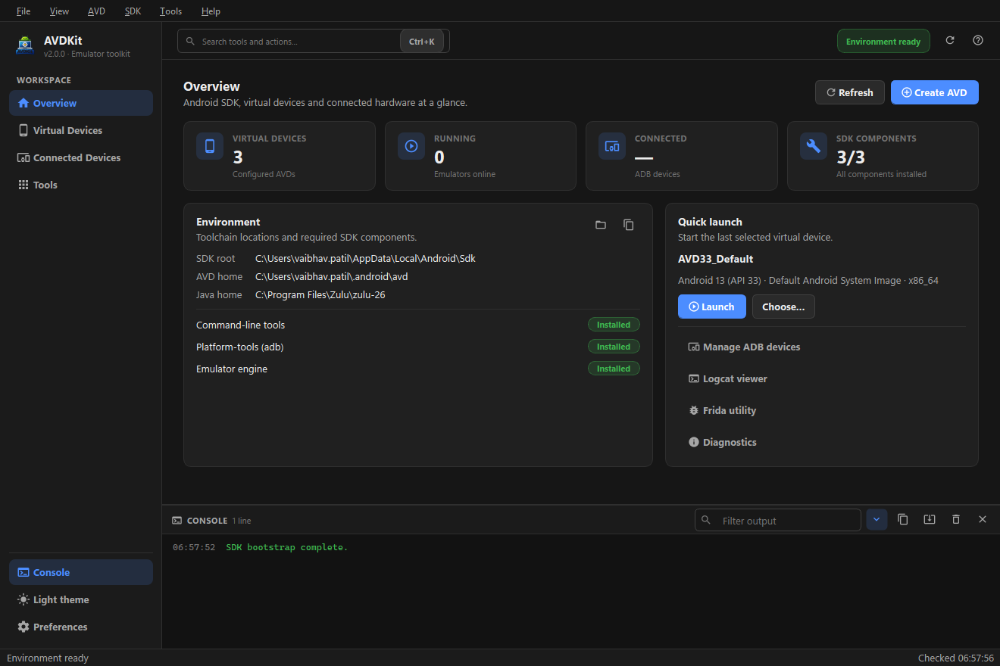

### Virtual Devices

The Virtual Devices page lists every AVD with its Android version, image, and ABI, and shows a details panel (device profile, memory, partitions, SD card, Play Store, location) for the selected device. Launch options — GPU renderer, RAM, CPU cores, writable system, cold boot, wipe data, and extra emulator flags — are saved as your defaults.

1. Filter and select an AVD
2. Review its configuration in the details panel
3. Adjust launch options as needed
4. **Launch** (`Ctrl+R`) — or **Stop** a running device — and launch several at once

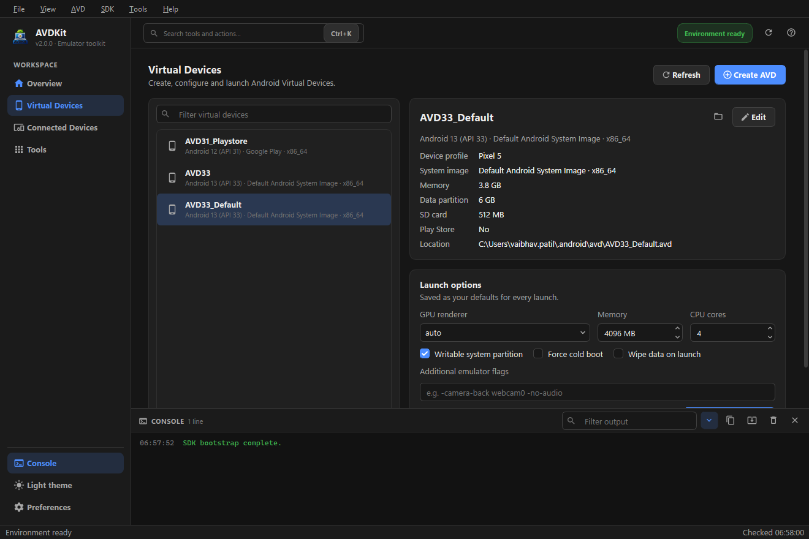

### Connected Devices

The Connected Devices page shows a live table of USB, network, and emulator devices with their current state. Set or clear a per-device HTTP proxy for traffic inspection, and jump straight into device tools.

- Auto-refreshing device list with connect/disconnect logging
- Per-device HTTP proxy set/clear
- Shortcuts to the Device Manager, Logcat, App Backup, Frida, CA certificates, and APKTools

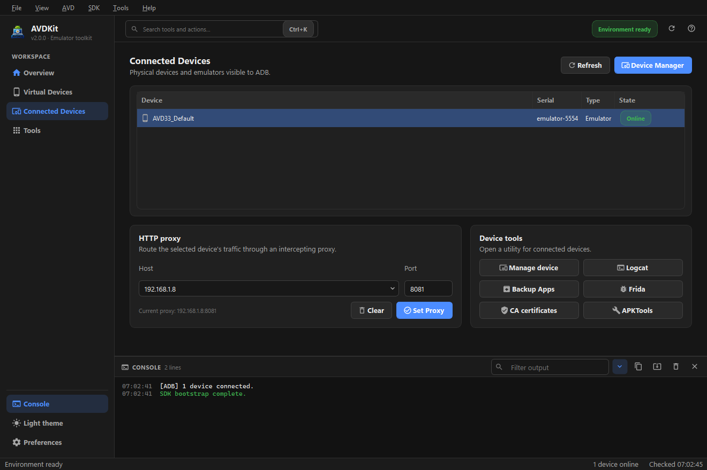

### Tools

The Tools page is a filterable launcher for every utility, grouped as **Security testing**, **Device utilities**, and **Network & certificates**, so a wide toolset stays discoverable without crowding the main pages.

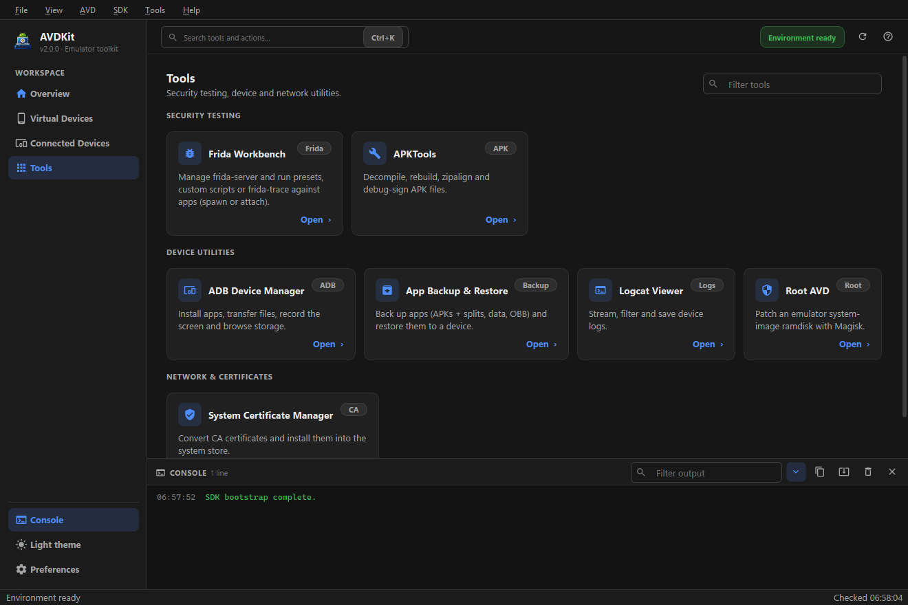

### Command Palette

Press `Ctrl+K` anywhere to fuzzy-search across pages, tools, AVDs (“Launch Pixel_7…”), connected devices, and actions — then run them with a keystroke.

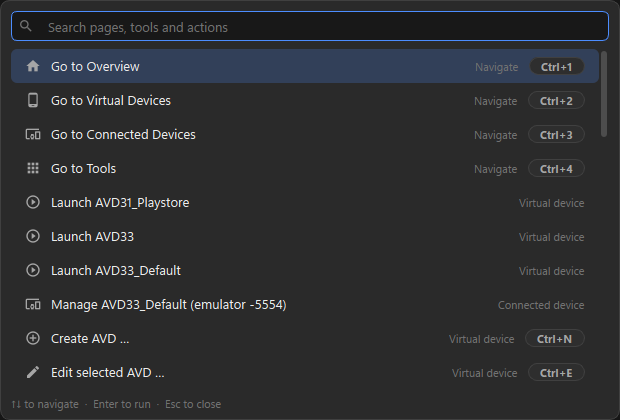

---

## Create & Edit AVDs

### Create AVD

The Create AVD workflow provisions virtual devices from one guided flow. Browse a cached catalog of system images, filter by API level or family, download missing images (or delete installed ones), pick a device profile, and create — all without switching to external SDK tools.

1. Browse and filter the system-image catalog
2. Download the selected image if it isn't already installed
3. Enter an AVD name and choose a device profile
4. Create the virtual device without leaving the workflow

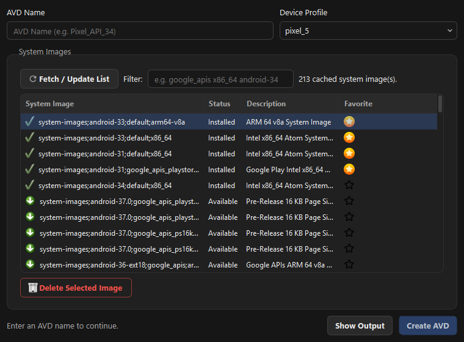

### Edit AVD

The Edit AVD screen maintains existing virtual devices without manual file edits — review the device overview and adjust startup behavior, display, hardware, camera, and sensor settings, then save.

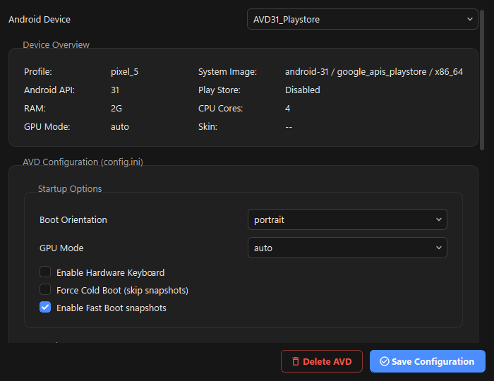

---

## ADB Device Manager

The ADB Device Manager is the central console for a connected emulator or device. A shared device selector sits on top and a command log at the bottom, with the workspace split into six tabs.

- **Overview** — a rich device dashboard (model, Android/API, ABI, brand, serial, root state, storage, battery, resolution, density, Wi-Fi IP, uptime) plus quick controls: keyevents (Home/Back/Recents/Notifications/Volume/Power), send text, rotate, Wi-Fi/data toggles, and a reboot menu
- **Apps** — an app manager with a searchable package list (user/system/all) and per-app actions: launch, force-stop, clear data, App Info screen, extract APK, view permissions, enable/disable, uninstall, plus APK / split-APK install
- **Files** — a device file explorer (open, up, new folder, upload, download, delete) with push/pull
- **Screen** — scrcpy screen mirroring and control, one-click screenshot, and screen recording
- **Shell** — an interactive `adb shell` with scrolling output, plus logcat capture controls
- **Network** — HTTP proxy set/clear and a port-forwarding manager (forward/reverse list, add, remove)

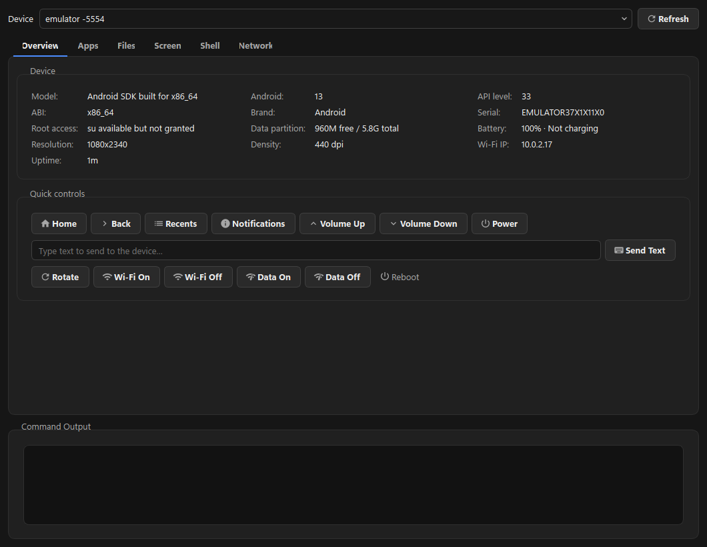

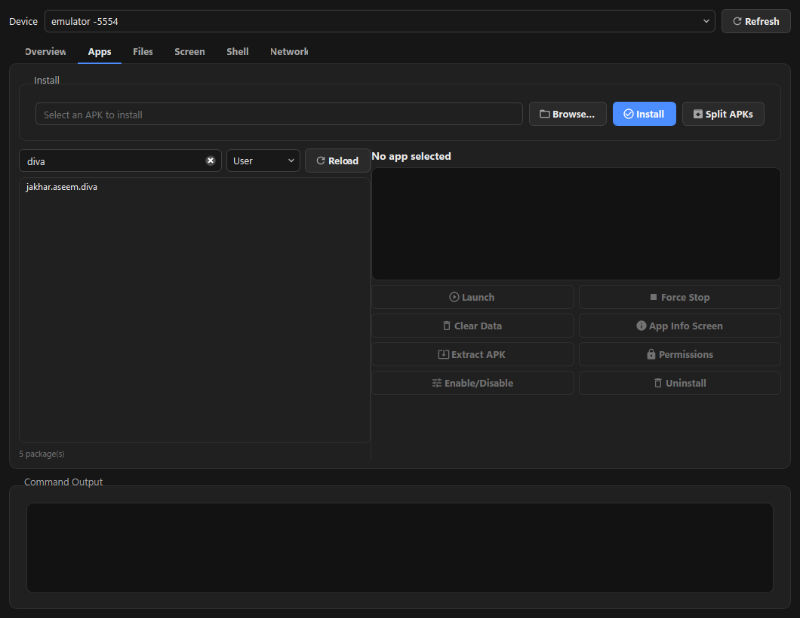

---

## Security & Testing Tools

### Frida Workbench

The Frida Workbench is a full instrumentation workbench that replaces the separate Runtime Hook Launcher and TLS/Pinning Analyzer.

- **Setup** — detect the local Frida version, download and push the matching frida-server, and start it as root with live status
- **Execution** — spawn a package (`-f`) via a searchable picker or attach to a running app; run scripts from a curated preset library (SSL/TLS pinning bypass, root-detection bypass, crypto/digest logger, WebView inspection, clipboard/intent logger, native tracer), a local file, or a CodeShare download; edit any script in-app and save it back to the library; or switch to `frida-trace` mode for native and Java patterns

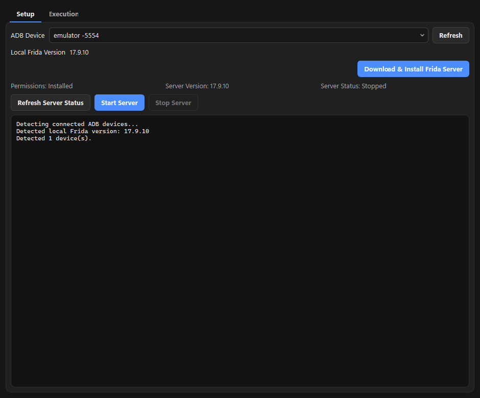

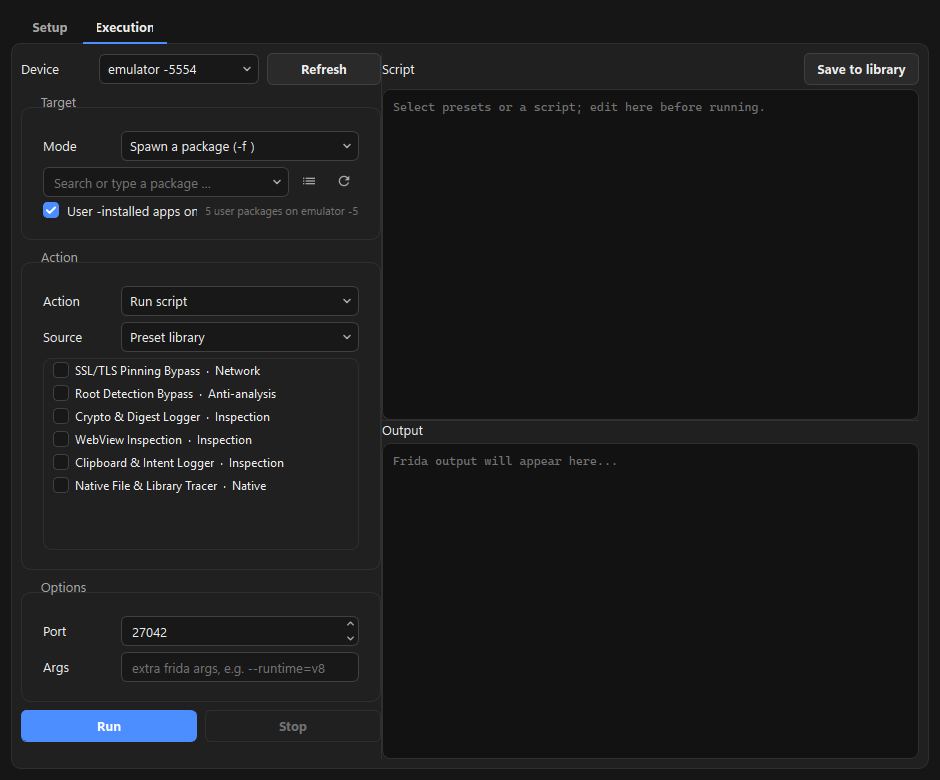

### System Certificate Manager

The System Certificate Manager converts a CA certificate (`.cer/.crt/.pem/.der`) into Android's system format and installs it persistently into the device trust store. Installation runs in the background with progress and per-step logs, and includes an automatic dm-verity fallback, so the certificate appears under **Settings → Trusted credentials → System** and survives reboots.

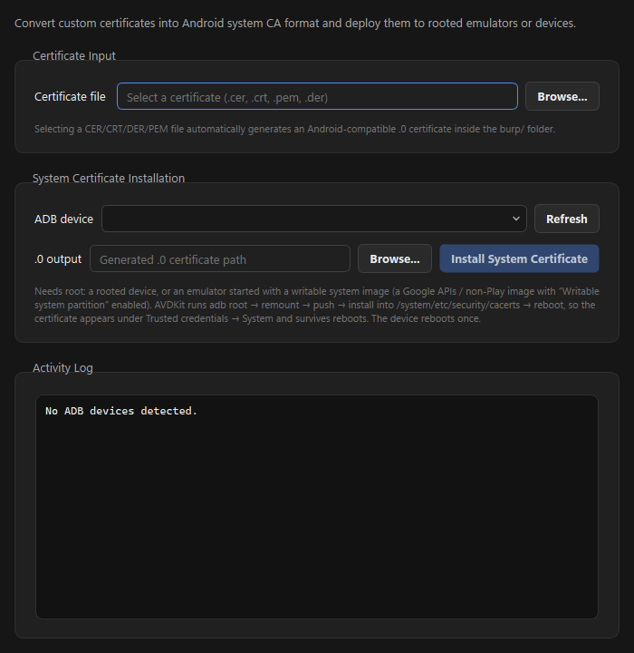

### APKTools

APKTools wraps common APK reverse-engineering steps — decompile, rebuild, zipalign, and debug-sign — with automatic APKTool download and inline per-operation progress.

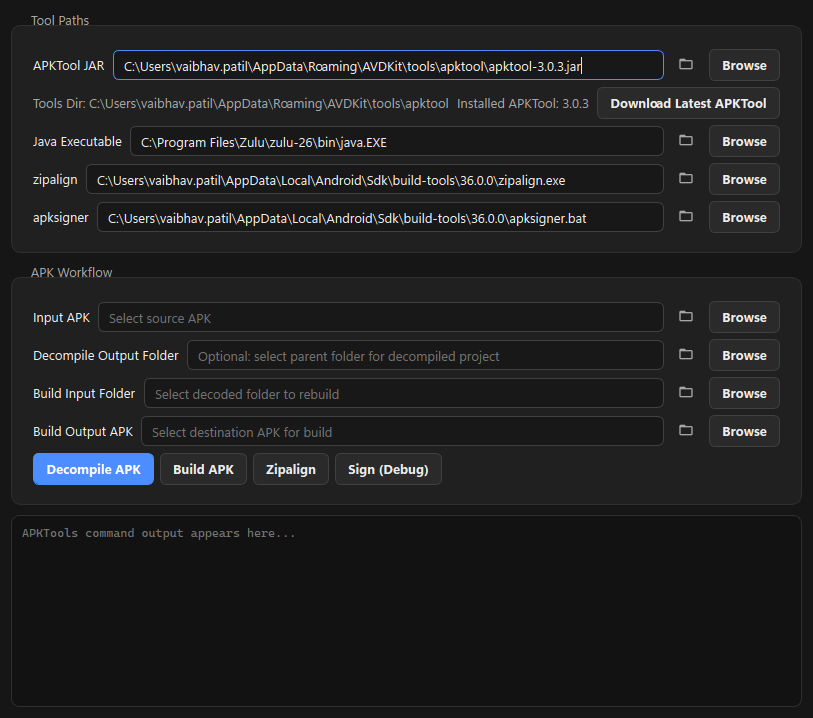

---

## Device Utilities

### App Backup & Restore

App Backup & Restore replaces the old single-APK extractor with a bulk workflow.

- **Backup** — multi-select apps (user/system/all), always capturing APK + split APKs, and optionally external data + OBB and — with root — internal `/data/data`. Each app is saved to its own folder with metadata.
- **Restore** — scan a backup folder and reinstall selected apps via `install-multiple`, optionally pushing data/OBB (and internal data with root) back.

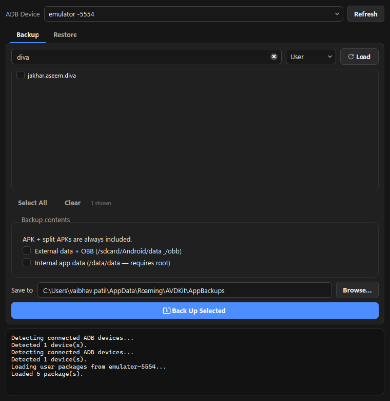

### Logcat Viewer

The Logcat Viewer captures and reviews Android logs inside the application — choose a buffer and level, filter by tag, keyword, or target app, and stream, save, or snapshot the output while reproducing an issue.

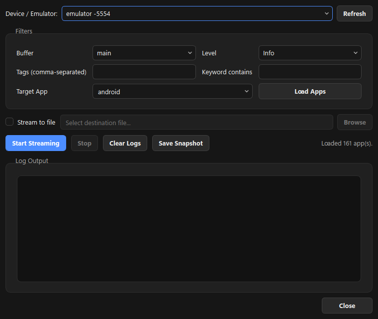

### Root AVD

The Root AVD workflow patches an emulator's system-image ramdisk with Magisk directly from the tool — no external scripts required. Select a target AVD and its matching `ramdisk.img`, patch it, then cold-boot the emulator to come up rooted.

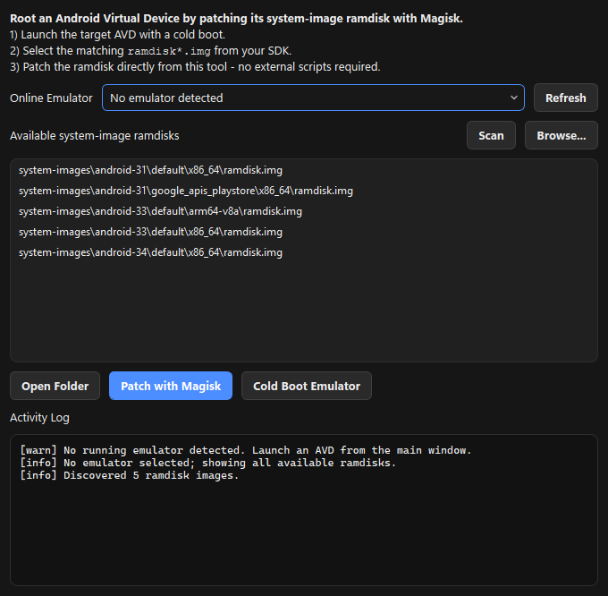

---

## Preferences & Theming

Preferences separate application-wide settings from daily workflows. The **Appearance** page offers dark, light, and match-system themes plus accent colors, with a live preview (Cancel reverts). A **Toolchains** page manages SDK and Java overrides.

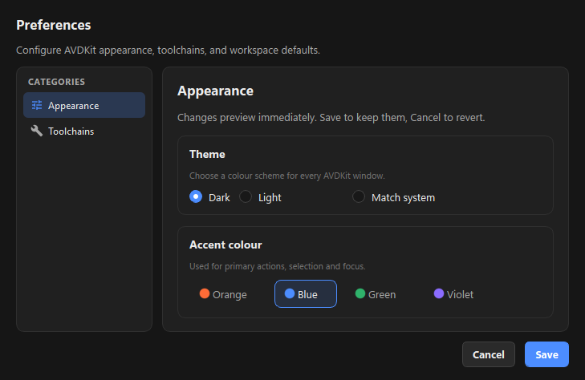

---

## Why Teams Use AVDKit

Instead of moving between SDK tools, emulator controls, ADB commands, proxy setup, certificate preparation, logging, and instrumentation utilities, AVDKit keeps related actions grouped in one themed workspace.

Common use cases:

- Android application testing and emulator profile management
- Proxy and traffic-inspection preparation
- Certificate conversion and persistent system-trust installation
- Runtime instrumentation and pinning/root-detection analysis with Frida
- Bulk app backup/restore and rooted-emulator preparation

---

## 📣 Feedback & Issues

This is a public distribution repository. If you encounter any issues or bugs, or have feature suggestions, please open an issue.

Your feedback helps improve the stability and usability of AVDKit.
